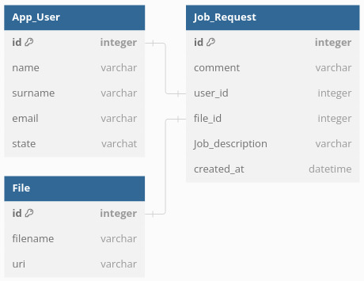
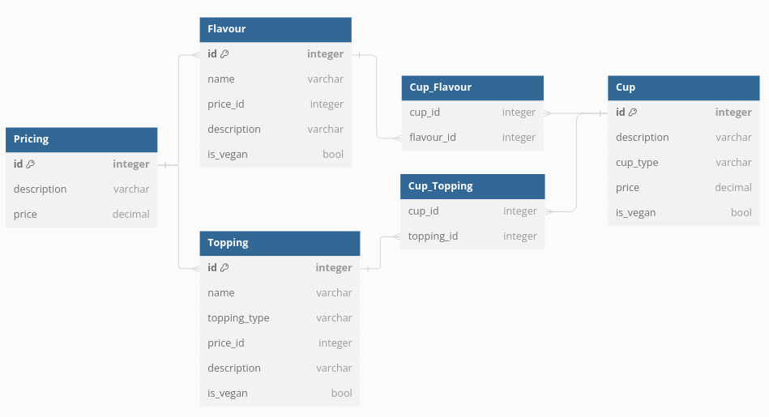

# Ice Coffee Shop RESTful Web Application

Design of a RESTful Web Application dedicated to a particular Ice Coffee Shop! This application serves as an anchor point for consumers, providing an interactive and user-friendly way to gather information about the business, explore the menu, as well as apply for jobs and internships. Furthermore, authorized users can refine the menu within the view and manage job requests, realizing administratory and content management aspects of this software.

## Table of Contents

1. [Features](#features)
2. [Technologies Used](#technologies-used)
3. [Architecture](#architecture)
4. [Database Schema](#database-schema)

## Features

- **Menu Browsing**: Users can scroll through the comprehensive menu, including beverages, snacks and cups.
- **Product Information**: Descriptions and images for each product.
- **Customizable Options**: Information on customizable options such as flavours and toppings.
- **Job Applications**: Users can apply for job positions at the ice coffee shop.
- **Admin Management**: Admin accounts can manipulate the data represented in the view, including adding, updating, or deleting menu items. Job requests are either acceptable or rejectable, while the CVs can downloaded.

## Technologies Used

- **Backend**: Java, Spring Boot
- **Frontend**: Thymeleaf, Vanilla JavaScript, Bootstrap
- **Database**: H2
- **Frameworks**: Jakarta, JPA, Hibernate
- **Build Tool**: Gradle
- **Security**: Spring Security

## Architecture

The Ice Coffee Shop (single page) application follows the Model-View-Controller (MVC) architectural pattern, ensuring a clear separation of concerns and facilitating maintainable and scalable code.

### Models

The Model component represents the data and business logic of the application. It properly models entities such as `User`, `Cup`, and `JobRequest`, adhering to a lightweight database schema.

### View

The View component is responsible for presenting data to users. It utilizes Thymeleaf templates for server-side rendering, Bootstrap for responsive styling, and Vanilla JavaScript for client-side interactivity. Within this application, authorities and consumers share the same view, allowing them to preview previously edited or added content.

### Controller

The Controller component handles user input and interacts with the Model to process data and update the View. Spring Boot facilitates the creation of RESTful API endpoints, enabling seamless communication between the front end and back end. While the HomeController sets model properties and views, more specific controllers (JobController) implement the api.

## Database Schema

The application uses an H2 database to store and manage data. Below are the schemas for the job request and menu features, represented through relational database diagrams.

### Job Request Feature

The Job Request feature allows users to apply for jobs at the ice coffee shop. The relational database schema for this feature includes entities such as `JobApplication` and `App_User`, as well as the `File`, which are `One-to-One` realted and cascaded. Thus, a accepted or rejected job request deletes the associated `File`, while `App_User` entries are only cleared on rejections.



### Menu Feature

The Menu feature enables users to browse the available products, including cups, flavors, and toppings. The relational database schema for this feature includes entities such as `Cup` and `Topping`. A `Topping` is hierarchical, categorized as either `Fruit`,  `Sauce` or  `Candy` determining its pricing. `Pricing` is managed within a single table, allowing for variability and adaptability to changing prices for both `Topping` and `Falvours`, holding `Many-to-One` relations. A `Cup` comprises both its `Topping` and `Falvours` entities, each maintained in separate tables. Consumers can either create a custom cup, with the price calculated from the pricing table, or an administrator can manually set the price, in order to update the entries within the `Cup` table accordingly



## Spring Security Authentication

The application uses Spring Security for authentication, providing a robust and secure framework for managing user access. Several aspects of the default Spring Security configuration have been modified to better suit the needs of modern reactive applications.

### Custom Login Page

Instead of using the default Spring Security login page, a custom login page has been created. This approach allows for a more user-friendly interface and ensures seamless integration of the login form with the rest of the application's design. The custom login page is configured in the Spring Security configuration using the `.loginPage("/login")` method.

### Custom UserDetailsService

To authenticate users against the application's database, a custom `UserDetailsService` has been implemented. This service overrides the `loadUserByUsername` method to retrieve user details from the database. The returned `UserDetails` object includes the username, password, and granted authorities for the user. 

### Custom AuthenticationFailureHandler

To enhance the user experience when authentication fails, a custom `AuthenticationFailureHandler` has been implemented. This handler sends an HTTP error status and a custom error message to the client upon authentication failure. This setup allows handling authentication errors in the AJAX error function and provides more reactive interactions using alerts and without distracting redirects.

### Installation Guide

Ensure that Java 17 is set in your environment variables. The application is accessible at http://localhost:8080.

1. **Clone the Repository**
    ```bash
    apt-get update
    apt-get upgrade
    apt install openjdk-17-jdk openjdk-17-jre

    git clone git@github.com:MaDoedel/eis-cafe.git
    cd eis-cafe
    ```
2. ***Start Application in Windows***
    ```bash
    gradlew.bat bootRun        
    ```

2. ***Start Application in Linux***
    ```bash
    ./gradlew bootRun
    ```

## TODO
- [ ] Create a more stylish landing page.
- [ ] Implement responsive design.
- [ ] Design the Drinks page.
- [ ] Add picture selection and description fields for cups.
- [ ] Fix the addCup error.
- [ ] Rework navigation.
- [ ] Draw a better database overview for the README.
- [ ] Check the Unique keyword (JPA related).
- [ ] Write about the JavaScript input validation bridge with and without Event Listeners. Although it is implemented and used, it has not been introduced.